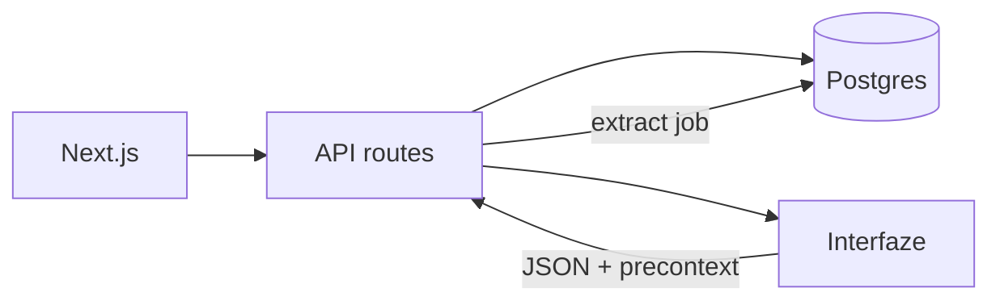

# Architecture

Vouch is a receipt-split app. Upload paper (grocery receipt or payment screenshot). Extraction runs in the Next.js app (and locally in a worker). Review shows fields with bounding boxes. Housemates claim lines. Nobody talks to Interfaze from the browser.

## Runtime

- **web** — Next.js App Router. Upload, review, share. Enqueues a job then processes it (`after()` + poll). On Vercel this is the only process.
- **worker** — Local `pnpm local` loop. Claims `jobs` with `FOR UPDATE SKIP LOCKED`. Same extract path as web.
- **db** — Docker Postgres locally. Supabase or Neon in production.

## Extraction

1. Guardrails first. Unsafe → `rejected`.
2. Image is inlined as a data URL so Interfaze does not fetch localhost.
3. OCR, then structured extract (`grocery-receipt` or `payment-screenshot`). Nested `items[]` flatten to `item_N` + price.
4. Persist raw `precontext` JSONB. The canvas never re-calls Interfaze to draw boxes.
5. Field status: `auto` if confidence ≥ workspace threshold (default `0.92`), else `needs_review`. Human edits never overwrite `model_value`.

## Splits

`documents.share_token` + `split_claims`. Claimable keys: `amount` or `item_N`. Share page is display-name only. Export line is merchant, date, total, and people who tapped **I owe this**.

## Auth

Demo cookie + one seeded user/workspace (`packages/db/src/demo.ts`).

Secrets stay in `.env.local` and Vercel env. Never commit them.
