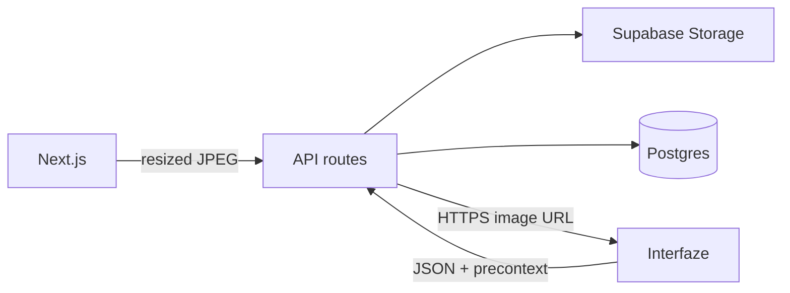

# Architecture

Vouch is a receipt-split app. Upload paper (grocery receipt or payment screenshot). Extraction runs in the Next.js app (and locally in a worker). Review shows fields with bounding boxes. Housemates claim lines. Nobody talks to Interfaze from the browser.

## Runtime

- **web** — Next.js App Router. Upload, review, share. Enqueues a job then processes it (`after()` + poll). On Vercel this is the only process.
- **worker** — Local `pnpm local` loop. Claims `jobs` with `FOR UPDATE SKIP LOCKED`. Same extract path as web.
- **db** — Docker Postgres locally. Supabase (or Neon) in production. Receipt **bytes** are not stored in Postgres.
- **Storage** — Public bucket `receipts`. `documents.source_url` is `https://<project>.supabase.co/storage/v1/object/public/receipts/<uuid>.jpg`. GET document/split JSON returns that URL (or `/api/…/image` for old data URLs), never the bytes.

## Extraction

1. `sharp` resizes to max edge 1800px, JPEG quality 85. Client may compress before POST; server is source of truth.
2. Upload to Storage when `NEXT_PUBLIC_SUPABASE_URL` + `SUPABASE_SERVICE_ROLE_KEY` are set. Otherwise local disk, or a resized data URL on Vercel.
3. One Interfaze `extract` call with a public HTTPS URL (or a small data URL locally). Logs: `[extract] interfaze <ms> bytes=…`. Typical live OCR is 15–40s; ingest is not.
4. Nested `items[]` flatten to `item_N` + price. Literal `null` / `n/a` values are dropped.
5. Persist raw `precontext` JSONB. The canvas never re-calls Interfaze to draw boxes.
6. Field status: `auto` if confidence ≥ workspace threshold (default `0.92`), else `needs_review`. Human edits never overwrite `model_value`. Empty OCR → compact fail card (try another photo / type it).

## Splits

`documents.share_token` + `split_claims`. Claimable keys: `amount` or `item_N`. Share page is display-name only. Review requires **That's me** before claim buttons work. Export line is merchant, date, total, and people who tapped **I owe this**.

## Auth

Demo cookie + one seeded user/workspace (`packages/db/src/demo.ts`).

Secrets stay in `.env.local` and Vercel env. Never commit them. Use the Supabase **secret** key (`sb_secret_…`) for Storage, not the publishable key.
