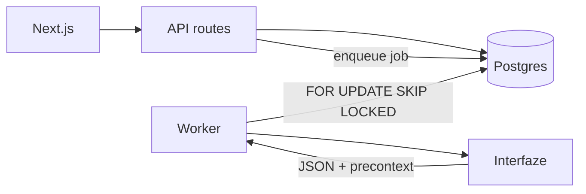

# Architecture

Vouch is a receipt-split app. Upload paper (grocery receipt or payment screenshot). A worker calls Interfaze. Review shows fields with bounding boxes. Housemates claim lines. Nobody talks to Interfaze from the browser.

## Runtime

- **web** — Next.js App Router. Upload, review, share links. Enqueues jobs. Does not call Interfaze on the request path.
- **worker** — Claims `jobs` with `FOR UPDATE SKIP LOCKED`. Guard → OCR → structured extract. Writes `fields` + `precontext`.
- **db** — Docker Postgres locally. Schema in `packages/db/sql/`.

## Extraction

1. Guardrails first. Unsafe → `rejected`.
2. OCR (`tasks.ocr`).
3. Structured extract against the template schema (`grocery-receipt` or `payment-screenshot`). Nested `items[]` flatten to `item_N` + price.
4. Persist raw `precontext` JSONB. The canvas never re-calls Interfaze to draw boxes.
5. Field status: `auto` if confidence ≥ workspace threshold (default `0.92`), else `needs_review`. Human edits never overwrite `model_value`.

Live Interfaze needs a URL it can fetch. `http://localhost:3000/...` fails (`file_processing_error`); the worker then uses fixtures so review still opens.

## Splits

`documents.share_token` + `split_claims`. Claimable keys: `amount` or `item_N`. Share page is display-name only (no accounts). Export line is built from merchant, date, total, and people who tapped **I owe this**.

## Auth today

Demo cookie + one seeded user/workspace (`packages/db/src/demo.ts`). Supabase and Stripe env vars are leftovers from an earlier product; Vouch does not depend on them yet.

Secrets stay in `.env.local`. Never commit that file.
