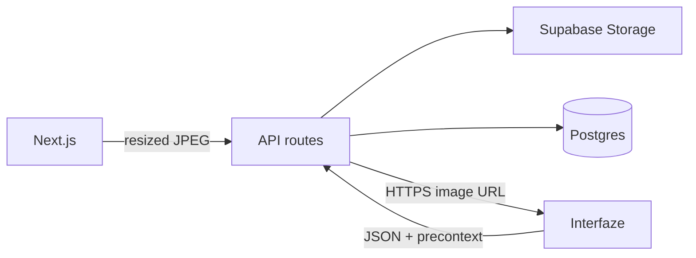

# Architecture

Vouch is a receipt-split app. Sign up, upload paper (grocery receipt or payment screenshot) or type the lines. Extraction runs in the Next.js app (and locally in a worker). Review shows fields with bounding boxes; owners can skip junk lines and rename items. Housemates claim lines. Groups keep balances. Nobody talks to Interfaze from the browser.

## Runtime

- **web** — Next.js App Router. Auth, upload, review, groups, share. Enqueues a job then processes it (`after()` + poll). On Vercel this is the only process.
- **worker** — Local `pnpm local` loop. Claims `jobs` with `FOR UPDATE SKIP LOCKED`. Same extract path as web.
- **db** — Docker Postgres locally. Supabase (or Neon) in production. Receipt **bytes** are not stored in Postgres.
- **Storage** — Public bucket `receipts`. `documents.source_url` is `https://<project>.supabase.co/storage/v1/object/public/receipts/<uuid>.jpg`. GET document/split JSON returns that URL (or `/api/…/image` for old data URLs), never the bytes.

## Auth

Email + password (`users.password_hash`). Session is an HMAC cookie (`SESSION_SECRET`) read in Node and Edge middleware. The secret must be the same in both, or the header looks signed-in while `/inbox` 307s back to `/login`.

Gated routes: `/new`, `/inbox`, `/groups`, `/account`, `/review/...`, `/onboarding`. Guests can hit `/`, `/login`, `/signup`, and `/s/...`. After signup, `/onboarding` until they start a group or skip.

Seed (`packages/db/src/seed.ts`) still inserts `demo@proofsheet.dev` with **no** password hash. That account cannot log in.

## Extraction

1. `sharp` resizes to max edge 1800px, JPEG quality 85. Client may compress before POST; server is source of truth.
2. Upload to Storage when `NEXT_PUBLIC_SUPABASE_URL` + `SUPABASE_SERVICE_ROLE_KEY` are set. Otherwise local disk, or a resized data URL on Vercel.
3. One Interfaze structured `extract` call with a public HTTPS URL (or a small data URL locally). Line items come from that response. OCR in `precontext` is only used to draw boxes. Logs: `[extract] interfaze …ms bytes=…`. Typical live extract is 15–40s; ingest is not.
4. Nested `items[]` flatten to `item_N` + price. Subtotal, tax, tip, and `currency` (ISO code from Interfaze) are stored when returned. Literal `null` / `n/a` values are dropped. The canvas uses `currency` for ₹ vs $ and does not show it as a line.
5. Persist raw `precontext` JSONB. The canvas never re-calls Interfaze to draw boxes.
6. Field status: `auto` if confidence ≥ workspace threshold (default `0.92`), else `needs_review`. Human edits never overwrite `model_value`. Empty OCR → compact fail card (try another photo / type it).
7. Typed receipts skip Interfaze and land on the same review canvas.
8. Ignored lines drop out of the split. Remainder is only the unnamed gap after items + tax + tip. `parseMoney` accepts empty or null field values.

## Splits and groups

`documents.share_token` + `split_claims`. Claimable keys: `amount` or `item_N`. Share page is display-name only. Review requires a confirmed identity before claim buttons work. Export line is merchant, date, total, and people who tapped **I owe this**.

A document may belong to a `groups` row. Members can be invited by name before they have an account. Stars are per-user (`group_stars`). Settlements and activity feed the group ledger (balances, totals, CSV).

## CI

GitHub Actions: **Build** (Next production build), **Test / unit** (`pnpm test`), **Test / e2e** (Postgres 16 service, migrate, Playwright Chromium, `PROOFSHEET_FIXTURE=1`). CI does not read production secrets.

Secrets stay in `.env.local` and Vercel env. Never commit them. Use the Supabase **secret** key (`sb_secret_…`) for Storage, not the publishable key.
